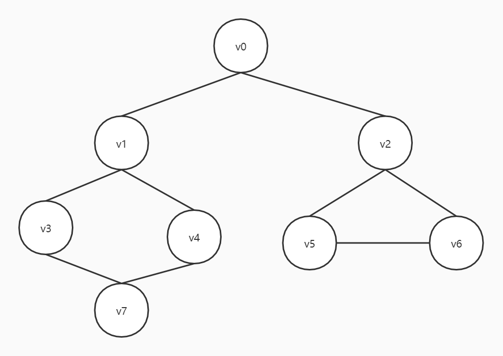

# 图的遍历

因为最近刷题做到图了所以写一下图的深度优先遍历和广度优先遍历。

图的表示方法有邻接矩阵和邻接表两种，这里采用的是类似邻接表的方式

图的样例为这样



遍历结果：

```
深度优先遍历
节点：0
节点：1
节点：3
节点：7
节点：4
节点：2
节点：5
节点：6
```

```
广度优先遍历
节点：0
节点：1
节点：2
节点：3
节点：4
节点：5
节点：6
节点：7
```

